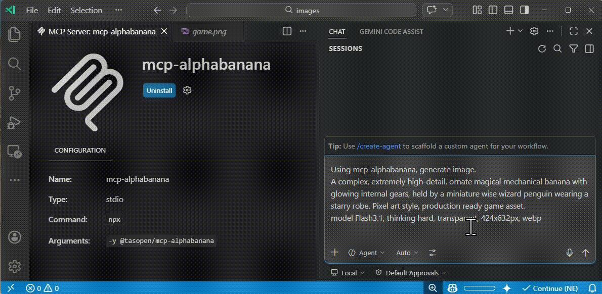

# mcp-alphabanana

[](https://www.npmjs.com/package/@tasopen/mcp-alphabanana)
[](LICENSE)

English | [日本語](README.ja.md)

mcp-alphabanana is a Model Context Protocol (MCP) server for generating image assets with Google Gemini. It is built for MCP-compatible clients and agent workflows that need fast image generation, transparent outputs, reference-image guidance, and flexible delivery formats.

Keywords: MCP server, Model Context Protocol, Gemini AI, image generation, FastMCP

Key capabilities:
- Ultra-fast Gemini image generation across Flash and Pro tiers
- Transparent PNG/WebP asset output for web and game pipelines
- Multi-image style guidance with local reference image files
- Flexible file, base64, or combined outputs for agent workflows



## Quick Start

Run the MCP server with npx:

```bash
npx -y @tasopen/mcp-alphabanana
```

Or add it to your MCP configuration:

```json
{
  "mcp": {
    "servers": {
      "alphabanana": {
        "command": "npx",
        "args": ["-y", "@tasopen/mcp-alphabanana"],
        "env": {
          "GEMINI_API_KEY": "${env:GEMINI_API_KEY}"
        }
      }
    }
  }
}
```

Set `GEMINI_API_KEY` before starting the server.

## MCP Server

This repository provides an MCP server that enables AI agents to generate images using Google Gemini.

It can be used with MCP-compatible clients such as:

- Claude Desktop
- VS Code MCP
- Cursor

Built with [FastMCP 3](https://www.npmjs.com/package/fastmcp) for a simplified codebase and flexible output options.

## Available Tools

### generate_image

Generates images using Google Gemini with optional transparency, local reference images, grounding, and reasoning metadata.

Key parameters:

- `prompt` (string): description of the image to generate
- `model`: `Flash3.1`, `Flash2.5`, `Pro3`, `flash`, `pro`
- `outputWidth` and `outputHeight`: requested final image size in pixels
- `output_resolution`: `0.5K`, `1K`, `2K`, `4K`
- `output_format`: `png`, `jpg`, `webp`
- `outputType`: `file`, `base64`, `combine`
- `outputPath`: required when `outputType` is `file` or `combine`
- `transparent`: enable transparent PNG/WebP post-processing
- `referenceImages`: optional array of local reference image files
- `grounding_type` and `thinking_mode`: advanced Gemini 3.1 controls

### Model Selection

| Input Model ID | Internal Model ID | Description |
| --- | --- | --- |
| `Flash3.1` | `gemini-3.1-flash-image-preview` | Ultra-fast, supports Thinking/Grounding. |
| `Flash2.5` | `gemini-2.5-flash-image` | Legacy Flash. High stability. Low cost. |
| `Pro3` | `gemini-3.0-pro-image-preview` | High-fidelity Pro model. |
| `flash` | `gemini-3.1-flash-image-preview` | Alias for backward compatibility. |
| `pro` | `gemini-3.0-pro-image-preview` | Alias for backward compatibility. |

### Parameters

Full parameter reference for the `generate_image` tool.

| Parameter | Type | Default | Description |
|-----------|------|---------|-------------|
| `prompt` | string | *required* | Description of the image to generate |
| `outputFileName` | string | *required* | Output filename (extension auto-added if missing) |
| `outputType` | enum | `combine` | `file`, `base64`, or `combine` |
| `model` | enum | `Flash3.1` | Model: `Flash3.1`, `Flash2.5`, `Pro3`, `flash`, `pro` |
| `output_resolution` | enum | auto | `0.5K`, `1K`, `2K`, `4K` (0.5K/2K/4K: Flash3.1 only) |
| `outputWidth` | integer | *required* | Final output width in pixels |
| `outputHeight` | integer | *required* | Final output height in pixels |
| `output_format` | enum | `png` | `png`, `jpg`, `webp` |
| `outputPath` | string | required for `file` / `combine` | Absolute output directory path |
| `transparent` | boolean | `false` | Transparent background (PNG/WebP only) |
| `transparentColor` | string or null | `null` | Color key override for transparency extraction |
| `colorTolerance` | integer | `30` | Transparency color matching tolerance |
| `fringeMode` | enum | `auto` | `auto`, `crisp`, `hd` |
| `resizeMode` | enum | `crop` | `crop`, `stretch`, `letterbox`, `contain` |
| `grounding_type` | enum | `none` | `none`, `text`, `image`, `both` (Flash3.1 only) |
| `thinking_mode` | enum | `minimal` | `minimal`, `high` (Flash3.1 only) |
| `include_thoughts` | boolean | `false` | Return model reasoning fields when metadata is enabled |
| `include_metadata` | boolean | `false` | Include grounding and reasoning metadata in JSON output |
| `referenceImages` | array | `[]` | Up to 14 local reference files (Flash3.1/Pro3), 3 for Flash2.5 |
| `debug` | boolean | `false` | Save intermediate debug artifacts |

## Why alphabanana?

- **Zero Watermarks:** API-native clean images.
- **Thinking/Grounding Support:** Higher prompt adherence and search-backed accuracy.
- **Production Ready:** Supports transparent WebP and exact aspect ratios for web and game assets.

## Features

- **Ultra-fast image generation** (Gemini 3.1 Flash, 0.5K/1K/2K/4K)
- **Advanced multi-image reasoning** (up to 14 reference images)
- **Thinking/Grounding support** (Flash3.1 only)
- **Transparent PNG/WebP output** (color-key post-processing, despill)
- **Multiple output formats**: file, base64, or both
- **Flexible resize modes**: crop, stretch, letterbox, contain
- **Multiple model tiers**: Flash3.1, Flash2.5, Pro3, legacy aliases

## Example Outputs

These sample outputs were generated with mcp-alphabanana and stored in [examples](examples).

| Pixel art asset | Reference-image game scene | Photorealistic generation |
| --- | --- | --- |
|  |  |  |

## Configuration

Configure the `GEMINI_API_KEY` in your MCP configuration (for example, `mcp.json`).

Examples:

- Reference an OS environment variable from `mcp.json`:

```json
{
  "env": {
    "GEMINI_API_KEY": "${env:GEMINI_API_KEY}"
  }
}
```

- Provide the key directly in `mcp.json`:

```json
{
  "env": {
    "GEMINI_API_KEY": "your_api_key_here"
  }
}
```

### VS Code Integration

Add to your VS Code settings (`.vscode/settings.json` or user settings), configuring the server `env` in `mcp.json` or via the VS Code MCP settings.

```json
{
  "mcp": {
    "servers": {
      "mcp-alphabanana": {
        "command": "npx",
        "args": ["-y", "@tasopen/mcp-alphabanana"],
        "env": {
          "GEMINI_API_KEY": "${env:GEMINI_API_KEY}"
        }
      }
    }
  }
}
```

**Optional:** Set a custom fallback directory for write failures by adding `MCP_FALLBACK_OUTPUT` to the `env` object.

## Usage Examples

#### Basic Generation

```json
{
  "prompt": "A pixel art treasure chest, golden trim, wooden texture",
  "model": "Flash3.1",
  "outputFileName": "chest",
  "outputType": "base64",
  "outputWidth": 64,
  "outputHeight": 64,
  "transparent": true
}
```

#### Advanced (Vertical poster and thinking)

```json
{
  "prompt": "A vertical, photorealistic travel poster advertising Magical Wings Day Tours. A joyful young couple flies high above a breathtaking European countryside at golden hour, holding hands as they soar through a partly cloudy sky. Below them are vineyards, villages, forests, a winding river, and a hilltop medieval castle. The poster uses large, elegant typography with the headline FLY THE COUNTRYSIDE at the top and Magical Wings Day Tours branding near the bottom.",
  "model": "Flash3.1",
  "output_resolution": "1K",
  "outputFileName": "photoreal-travel-poster",
  "outputType": "file",
  "outputPath": "/path/to/output",
  "outputWidth": 848,
  "outputHeight": 1264,
  "output_format": "jpg",
  "thinking_mode": "high",
  "include_metadata": true
}
```

#### Grounding Sample (Search-backed)

```json
{
  "prompt": "A modern travel poster featuring today's weather and skyline highlights in Kuala Lumpur",
  "model": "Flash3.1",
  "outputFileName": "kl_travel_poster",
  "outputType": "base64",
  "outputWidth": 1024,
  "outputHeight": 1024,
  "grounding_type": "text",
  "thinking_mode": "high",
  "include_metadata": true,
  "include_thoughts": true
}
```

This sample enables Google Search grounding and returns grounding and reasoning metadata in JSON.

#### With Reference Images

```json
{
  "prompt": "Use the reference image to create a game screen showing an opened treasure chest filled with coins and treasure, 8-bit dungeon crawler style, after-battle reward scene, dungeon corridor background, four-party status UI at the bottom",
  "model": "Flash3.1",
  "output_resolution": "0.5K",
  "outputFileName": "reference-image-dungeon-loot",
  "outputType": "file",
  "outputPath": "/path/to/output",
  "outputWidth": 600,
  "outputHeight": 448,
  "output_format": "webp",
  "transparent": false,
  "referenceImages": [
    {
      "description": "Treasure chest style reference",
      "filePath": "/path/to/references/pixel-art-treasure-chest.png"
    }
  ]
}
```

## Transparency & Output Formats

- **PNG**: Full alpha, color-key + despill
- **WebP**: Full alpha, better compression (Flash3.1+)
- **JPEG**: No transparency (falls back to solid background)

## Development

```bash
# Development mode with MCP CLI
npm run dev

# MCP Inspector (Web UI)
npm run inspect

# Build for production
npm run build
```

## License

MIT

